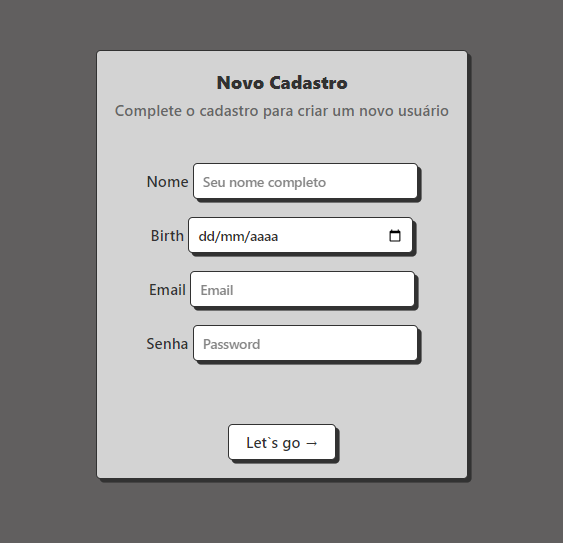

# PHPcrud
Este projeto foi criado para praticar o bom e velho crud usando PHP. Basicamente uma aplicação web desenvolvida em PHP que permite realizar operações básicas de CRUD (Create, Read, Update, Delete) para gerenciar usuários. Com esse sistema, os usuários poderão ser cadastrados, editados, listados e deletados através de uma interface amigável.

##Recursos e Funcionalidades:
Cadastro de Usuários: O sistema permitirá o cadastro de novos usuários, coletando informações como nome, e-mail e senha. Os dados serão armazenados em um banco de dados seguro.
Listagem de Usuários: Os usuários cadastrados serão listados em uma tabela de fácil visualização. Essa listagem fornecerá uma visão geral das informações básicas de cada usuário.
Edição de Usuários: Os usuários poderão ser editados através de um formulário de edição. As informações atualizadas serão refletidas no banco de dados.
Deleção de Usuários: Haverá uma opção para excluir usuários do sistema. Ao confirmar a deleção, o usuário será removido permanentemente do banco de dados.
##Tecnologias Utilizadas:
PHP: Linguagem de programação do lado do servidor utilizada para processar os dados e executar as operações CRUD.
MySQL: Banco de dados relacional utilizado para armazenar as informações dos usuários.
HTML/CSS: Utilizados para a estrutura e a estilização da interface do sistema.
JS: Para validações no front. 
